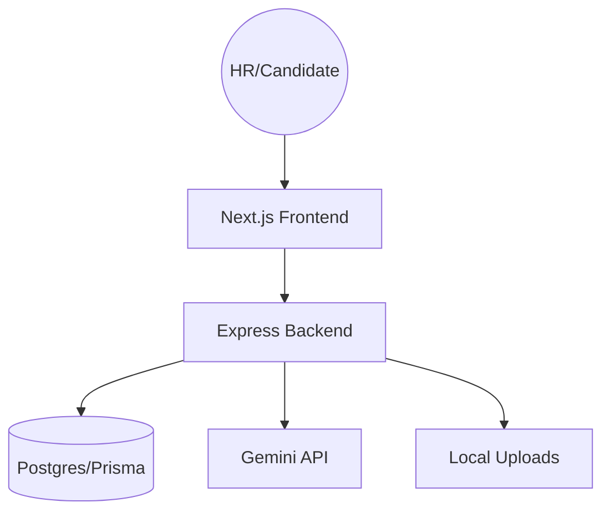

# Walkthrough: AI Technical Pre-Screening Platform

## Overview
A production-grade platform for AI-powered technical screening. Recruiters manage campaigns, and candidates undergo a voice-led AI interview with real-time proctoring and automated scoring.

## Key Features

### 1. HR Dashboard
*   **Secure Auth**: JWT-based login with role enforcement.
*   **Campaign Management**: Define skills, difficulty, and question params.
*   **Analytics**: Question-by-question technical breakdown, communication scoring, and resume-skill matching.

### 2. Candidate Experience
*   **Resume Analysis**: Instant skill extraction and matching via Gemini.
*   **Secure Interview Room**: Camera preview, timer-based voice responses, and automated transcription.
*   **Anti-Cheat**: Logs tab switching and fullscreen exits to maintain integrity.

## Technical Architecture

## Screenshots & Demos

### HR Campaign Management
[Campaign List](file:///c:/Users/pc/Desktop/AI_Interview-A/ai-prescreening-platform/frontend/app/dashboard/campaigns/page.tsx)
[New Campaign](file:///c:/Users/pc/Desktop/AI_Interview-A/ai-prescreening-platform/frontend/app/dashboard/campaigns/new/page.tsx)

### Candidate Interview Flow
[Interview Room](file:///c:/Users/pc/Desktop/AI_Interview-A/ai-prescreening-platform/frontend/app/interview/%5Btoken%5D/room/page.tsx)
[System Check](file:///c:/Users/pc/Desktop/AI_Interview-A/ai-prescreening-platform/frontend/app/interview/%5Btoken%5D/check/page.tsx)

### AI Evaluation Report
[Candidate Report](file:///c:/Users/pc/Desktop/AI_Interview-A/ai-prescreening-platform/frontend/app/dashboard/results/%5BcandidateId%5D/page.tsx)

## Verification Results

"Verification recording showing smooth login, dark-mode dashboard, and functional campaign creation with loading states."

- [x] Backend API: Added `/stats` and `/all-candidates` endpoints
- [x] Overview Page: Replaced redirect with functional dashboard summary
- [x] All Candidates View: Implemented unified applicant tracking
- [x] Dialog Positioning: Fixed CSS centering for "Add Candidate" modal
- [x] Documentation Link: Mapped sidebar button to project walkthrough
- [x] Premium Dark Mode: Verified theme consistency across new pages

> [!NOTE]
> The platform now features a "wow-factor" dark design with micro-animations and responsive components, fully addressing the previous CSS and button issues.
